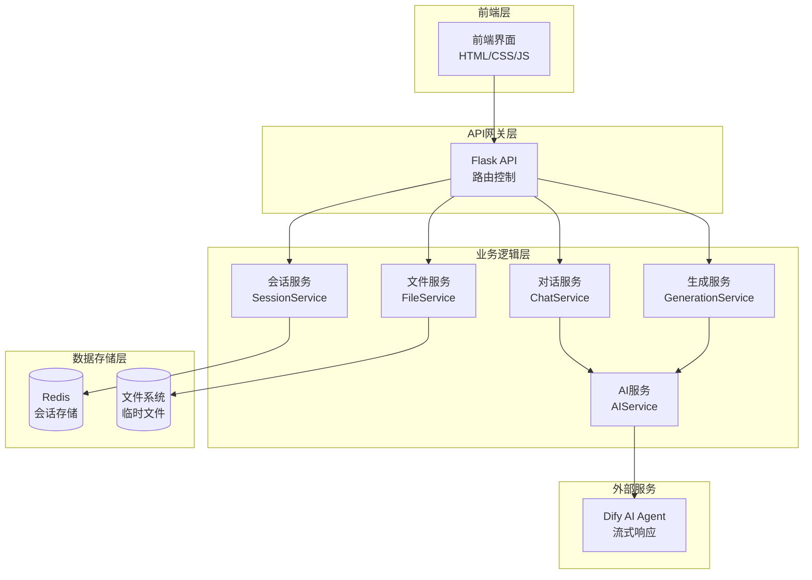

# 设计文档

## 概述

AI辅助测试用例生成工具后端服务基于Flask框架构建，提供RESTful API接口支持前端功能。系统采用模块化架构设计，支持文件上传处理、AI对话交互、测试用例生成、会话管理和流式响应等核心功能。

## 架构

### 系统架构图



### 技术栈

- **Web框架**: Flask 2.3+
- **会话存储**: Redis 7.0+
- **文件处理**: Werkzeug FileStorage
- **HTTP客户端**: requests (用于AI服务调用)
- **数据序列化**: JSON
- **XML处理**: xml.etree.ElementTree
- **流式响应**: Flask Response streaming
- **配置管理**: Flask Config

## 组件和接口

### 1. 应用入口 (app.py)

```python
from flask import Flask
from flask_cors import CORS
import redis
import os

def create_app():
    app = Flask(__name__)
    app.config.from_object('config.Config')
    
    # 启用CORS支持
    CORS(app)
    
    # 初始化Redis连接
    app.redis = redis.Redis(
        host=app.config['REDIS_HOST'],
        port=app.config['REDIS_PORT'],
        decode_responses=True
    )
    
    # 注册蓝图
    from routes.generation import generation_bp
    from routes.chat import chat_bp
    from routes.config import config_bp
    
    app.register_blueprint(generation_bp, url_prefix='/api/generation')
    app.register_blueprint(chat_bp, url_prefix='/api/chat')
    app.register_blueprint(config_bp, url_prefix='/api/config')
    
    return app
```

### 2. 路由控制器

#### 生成服务路由 (routes/generation.py)

```python
from flask import Blueprint, request, jsonify, Response
from services.generation_service import GenerationService
from services.session_service import SessionService
from utils.validators import validate_files

generation_bp = Blueprint('generation', __name__)

@generation_bp.route('/start', methods=['POST'])
def start_generation():
    """开始生成任务 - 处理文件上传和配置"""
    
@generation_bp.route('/generate', methods=['POST'])
def generate_test_cases():
    """生成测试用例"""
    
@generation_bp.route('/finalize', methods=['POST'])
def finalize_generation():
    """确认并生成最终文件"""
    
@generation_bp.route('/download', methods=['GET'])
def download_file():
    """下载用例文件"""
```

#### 对话服务路由 (routes/chat.py)

```python
from flask import Blueprint, request, jsonify
from services.chat_service import ChatService

chat_bp = Blueprint('chat', __name__)

@chat_bp.route('/send', methods=['POST'])
def send_message():
    """发送聊天消息"""
```

#### 配置服务路由 (routes/config.py)

```python
from flask import Blueprint, jsonify
from services.config_service import ConfigService

config_bp = Blueprint('config', __name__)

@config_bp.route('/api-versions', methods=['GET'])
def get_api_versions():
    """获取API版本列表"""
    
@config_bp.route('/preset-steps', methods=['GET'])
def get_preset_steps():
    """获取预设步骤列表"""
    
@config_bp.route('/preset-components', methods=['GET'])
def get_preset_components():
    """获取预设组件列表"""
```

### 3. 业务服务层

#### 文件服务 (services/file_service.py)

```python
class FileService:
    def __init__(self, upload_folder):
        self.upload_folder = upload_folder
    
    def save_uploaded_file(self, file, session_id, file_type):
        """保存上传的文件"""
        
    def parse_xml_file(self, file_path):
        """解析XML文件内容"""
        
    def generate_xml_output(self, test_cases):
        """生成XML格式的测试用例文件"""
        
    def cleanup_session_files(self, session_id):
        """清理会话相关的临时文件"""
```

#### 会话服务 (services/session_service.py)

```python
class SessionService:
    def __init__(self, redis_client):
        self.redis = redis_client
        self.session_timeout = 3600  # 1小时
    
    def create_session(self):
        """创建新的生成会话"""
        
    def get_session_data(self, session_id):
        """获取会话数据"""
        
    def update_session_data(self, session_id, data):
        """更新会话数据"""
        
    def extend_session(self, session_id):
        """延长会话有效期"""
        
    def delete_session(self, session_id):
        """删除会话"""
```

#### AI服务 (services/ai_service.py)

```python
class AIService:
    def __init__(self, dify_config):
        self.dify_url = dify_config['url']
        self.dify_token = dify_config['token']
        self.mock_mode = dify_config.get('mock_mode', True)
    
    def analyze_files(self, files_info):
        """分析上传的文件"""
        
    def chat_with_agent(self, session_id, message, context):
        """与AI Agent进行对话"""
        
    def generate_test_cases(self, session_id, context):
        """生成测试用例 - 支持流式响应"""
        
    def _mock_chat_response(self, message):
        """Mock对话响应"""
        
    def _mock_generation_stream(self):
        """Mock生成流式响应"""
```

#### 生成服务 (services/generation_service.py)

```python
class GenerationService:
    def __init__(self, file_service, session_service, ai_service):
        self.file_service = file_service
        self.session_service = session_service
        self.ai_service = ai_service
    
    def start_generation_task(self, files, config):
        """启动生成任务"""
        
    def process_chat_interaction(self, session_id, message):
        """处理聊天交互"""
        
    def generate_test_cases_stream(self, session_id):
        """流式生成测试用例"""
        
    def finalize_test_cases(self, session_id, test_cases):
        """确认并生成最终文件"""
```

### 4. 数据模型

#### 会话数据结构

```python
session_data = {
    'session_id': 'sess_abc123',
    'status': 'analyzing|chatting|generating|completed',
    'created_at': '2025-01-08T10:00:00Z',
    'updated_at': '2025-01-08T10:30:00Z',
    'files': {
        'history_case': 'path/to/history.xml',
        'case_template': 'path/to/template.xml',
        'aw_template': 'path/to/aw.xml'
    },
    'config': {
        'api_version': 'v2.0'
    },
    'chat_history': [
        {'role': 'ai', 'message': '...', 'timestamp': '...'},
        {'role': 'user', 'message': '...', 'timestamp': '...'}
    ],
    'analysis_result': {
        'template_info': '...',
        'history_info': '...'
    },
    'test_cases': [...],
    'generated_file_id': 'file_xyz789'
}
```

#### 测试用例数据结构

```python
test_case = {
    'id': 'TC001',
    'name': '用户登录功能测试',
    'preconditions': [
        {
            'id': 'pre1',
            'name': '用户已注册账号',
            'expanded': False,
            'components': [
                {
                    'id': 'prec1',
                    'type': 'api',
                    'name': '接口调用 - 检查用户存在',
                    'params': {
                        'method': 'GET',
                        'url': '/api/users/check',
                        'expected': True
                    }
                }
            ]
        }
    ],
    'steps': [...],  # 同样结构
    'expectedResults': [...]  # 同样结构
}
```

## 正确性属性

*属性是一个特征或行为，应该在系统的所有有效执行中保持为真——本质上，是关于系统应该做什么的正式声明。属性作为人类可读规范和机器可验证正确性保证之间的桥梁。*

基于需求分析，以下是系统的核心正确性属性：

### 属性 1: 文件上传会话创建
*对于任何*有效的用例模板文件和API版本配置，系统应该创建唯一的会话ID并正确存储文件信息
**验证: 需求 1.1, 1.2, 1.3**

### 属性 2: 文件格式验证
*对于任何*无效格式的上传文件，系统应该返回明确的错误信息而不是创建会话
**验证: 需求 1.4**

### 属性 3: 对话上下文一致性
*对于任何*有效会话中的对话消息，系统应该基于会话上下文返回相关回复并正确更新对话历史
**验证: 需求 2.1, 2.2**

### 属性 4: 关键词触发状态转换
*对于任何*包含"开始生成"关键词的用户消息，系统应该将会话状态标记为准备生成
**验证: 需求 2.3**

### 属性 5: 会话有效性验证
*对于任何*无效或过期的会话ID，系统应该返回会话无效错误而不是处理请求
**验证: 需求 2.4, 7.3**

### 属性 6: 测试用例生成完整性
*对于任何*完成对话的会话，生成的测试用例应该包含预置条件、测试步骤和预期结果的完整结构
**验证: 需求 3.1, 3.2, 3.4**

### 属性 7: 流式响应连续性
*对于任何*测试用例生成过程，系统应该持续返回进度信息直到生成完成
**验证: 需求 3.3, 9.2**

### 属性 8: XML格式转换正确性
*对于任何*有效的测试用例数据，系统应该能够转换为符合标准的XML格式并返回有效的文件ID
**验证: 需求 4.2, 4.3**

### 属性 9: 数据验证一致性
*对于任何*格式错误的测试用例数据，系统应该返回具体的验证错误信息
**验证: 需求 4.4**

### 属性 10: 文件下载权限控制
*对于任何*文件下载请求，系统应该验证文件ID有效性和会话权限，只有通过验证的请求才能下载文件
**验证: 需求 5.1, 5.2, 5.3, 5.4**

### 属性 11: HTTP响应头正确性
*对于任何*成功的文件下载，系统应该设置正确的Content-Type为application/xml和适当的文件名
**验证: 需求 5.5**

### 属性 12: 会话唯一性和生命周期
*对于任何*新创建的会话，系统应该生成全局唯一的会话ID并设置合理的过期时间
**验证: 需求 7.1, 7.2**

### 属性 13: 并发会话数据一致性
*对于任何*并发访问同一会话的请求，系统应该确保会话数据的一致性和完整性
**验证: 需求 7.4**

### 属性 14: 错误处理和日志记录
*对于任何*系统错误或异常情况，系统应该记录详细的错误日志并返回用户友好的错误信息
**验证: 需求 8.1, 8.2, 8.3**

### 属性 15: 服务降级处理
*对于任何*外部服务（如AI服务）不可用的情况，系统应该提供Mock数据或降级处理
**验证: 需求 8.4, 10.1, 10.2**

### 属性 16: 输入安全验证
*对于任何*用户输入数据，系统应该进行安全验证以防止恶意输入和安全漏洞
**验证: 需求 9.5**

### 属性 17: Mock模式一致性
*对于任何*Mock模式下的操作，系统应该返回符合真实数据结构的示例数据并模拟真实的处理流程
**验证: 需求 10.3, 10.4**

## 错误处理

### 错误分类和处理策略

1. **文件处理错误**
   - 文件格式不正确：返回400错误和具体格式要求
   - 文件大小超限：返回413错误和大小限制信息
   - 文件解析失败：返回422错误和解析错误详情

2. **会话管理错误**
   - 会话不存在：返回404错误
   - 会话已过期：返回410错误
   - 会话状态不正确：返回409错误

3. **AI服务错误**
   - 服务不可用：切换到Mock模式或返回503错误
   - 响应超时：返回504错误
   - 响应格式错误：记录日志并使用默认响应

4. **数据验证错误**
   - 必填字段缺失：返回400错误和缺失字段列表
   - 数据格式错误：返回422错误和格式要求
   - 数据长度超限：返回413错误和长度限制

### 错误响应格式

```json
{
  "success": false,
  "error": "错误类型",
  "message": "用户友好的错误描述",
  "details": {
    "code": "ERROR_CODE",
    "timestamp": "2025-01-08T10:00:00Z",
    "request_id": "req_123456"
  }
}
```

## 测试策略

### 双重测试方法

系统将采用单元测试和属性测试相结合的方法：

**单元测试**：
- 验证具体的功能实现和边界条件
- 测试特定的错误场景和异常处理
- 验证API接口的输入输出格式
- 测试Mock数据的正确性

**属性测试**：
- 验证系统的通用正确性属性
- 使用随机生成的测试数据进行大量测试
- 验证数据转换的一致性和完整性
- 测试并发场景下的数据一致性

### 属性测试配置

- **测试框架**: pytest + hypothesis
- **最小迭代次数**: 100次每个属性测试
- **测试标签格式**: **Feature: ai-test-case-generator, Property {number}: {property_text}**
- **数据生成策略**: 使用hypothesis生成符合业务规则的随机测试数据

### 测试覆盖范围

1. **API接口测试**
   - 所有REST API端点的正常和异常场景
   - 文件上传的各种格式和大小
   - 会话管理的完整生命周期

2. **业务逻辑测试**
   - 文件解析和XML生成的正确性
   - AI对话交互的状态管理
   - 测试用例生成的数据完整性

3. **集成测试**
   - Redis会话存储的数据一致性
   - 文件系统操作的可靠性
   - 外部AI服务的集成和降级

4. **性能测试**
   - 文件上传和处理的响应时间
   - 流式响应的实时性
   - 并发请求的处理能力
