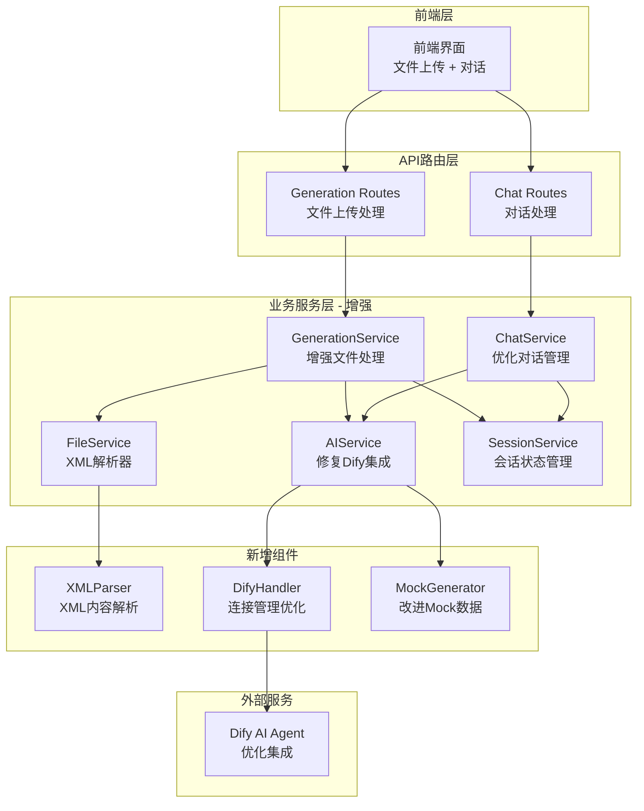

# 设计文档

## 概述

文件上传自动分析功能设计基于现有的AI辅助测试用例生成工具架构，通过增强现有服务组件来实现文件上传后的自动解析、Dify集成优化和生成流程修复。该项目已有完善的Flask后端架构、135+测试用例和生产级部署方案，本设计采用最小侵入性原则，在保持现有架构稳定的基础上，通过服务层增强和流程优化来解决当前的三个核心问题：

1. **文件上传后缺少自动分析**：目前需要手动发送消息才能开始AI对话
2. **"开始生成用例"按钮无响应**：点击后进度条不动，无法生成数据
3. **Dify集成存在连接泄漏**：HTTP连接管理问题导致资源泄漏和异常日志

## 架构

### 系统架构图



### 核心改进点

1. **文件上传自动分析流程**：在GenerationService.start_generation_task()中增加自动解析和发送逻辑
2. **XML解析器增强**：增强现有FileService的XML解析能力，提取测试用例描述
3. **Dify集成优化**：修复AIService中DifyHandler的连接管理和会话复用问题
4. **生成流程修复**：修复GenerationService.generate_test_cases_stream()中的异步生成器问题
5. **资源管理改进**：改进异步连接的生命周期管理，解决"Unclosed client session"错误

## 组件和接口

### 1. 增强的GenerationService

```python
class GenerationService:
    """增强的生成服务 - 支持文件自动分析"""
    
    def start_generation_task(self, files: Dict[str, Any], config: Dict[str, Any]) -> Dict[str, Any]:
        """
        启动生成任务 - 增加自动分析功能
        
        现有流程：
        1. 创建会话并保存文件
        2. 调用ai_service.analyze_files() (已存在)
        3. 返回初始分析结果
        
        新增流程：
        4. 自动解析XML文件内容 (新增)
        5. 自动发送解析内容给Dify (新增)
        6. 返回Dify的初始分析结果
        """
        # ... 现有代码保持不变 ...
        
        # 新增：自动解析并发送给AI
        if analysis_result.get('success', True):
            try:
                auto_analysis_result = await self.auto_analyze_and_chat(session_id, files_info)
                if auto_analysis_result.get('success'):
                    # 更新会话状态为chatting，准备接收用户输入
                    self.session_service.update_session_data(session_id, {
                        'status': 'chatting',
                        'initial_ai_response': auto_analysis_result.get('reply', ''),
                        'dify_conversation_id': auto_analysis_result.get('conversation_id')
                    })
                    return {
                        'success': True,
                        'session_id': session_id,
                        'message': auto_analysis_result.get('reply', '文件分析完成'),
                        'initial_analysis': analysis_result,
                        'auto_chat_started': True
                    }
            except Exception as e:
                logger.warning(f"自动分析失败，使用原有流程: {e}")
        
        # 原有返回逻辑保持不变
        return {
            'success': True,
            'session_id': session_id,
            'message': initial_message,
            'initial_analysis': analysis_result,
            'files_processed': len(files_info)
        }
        
    async def auto_analyze_and_chat(self, session_id: str, files_info: Dict[str, Any]) -> Dict[str, Any]:
        """
        自动分析文件并发送给Dify (新增方法)
        
        Args:
            session_id: 会话ID
            files_info: 文件信息
            
        Returns:
            Dict[str, Any]: Dify分析结果
        """
        try:
            # 1. 解析XML文件内容
            extracted_content = self._extract_test_case_content(files_info)
            
            # 2. 构建发送给Dify的消息
            message = f"请分析以下测试用例内容，并提出完善建议：\n\n{extracted_content}"
            
            # 3. 发送给AI服务
            context = {
                'files_info': files_info,
                'extracted_content': extracted_content
            }
            
            response = await self.ai_service.chat_with_agent(session_id, message, context)
            return response
            
        except Exception as e:
            logger.error(f"自动分析和对话失败: {e}")
            return {'success': False, 'error': str(e)}
    
    def _extract_test_case_content(self, files_info: Dict[str, Any]) -> str:
        """
        从文件信息中提取测试用例内容 (新增方法)
        
        Args:
            files_info: 文件信息字典
            
        Returns:
            str: 提取的测试用例描述
        """
        if 'case_template' not in files_info:
            return "【预置条件】\n1. CBS系统运行正常\n2. 修改系统变量SYS_abc的值为12\n3. 设置变量，初始金额为100\n\n【测试步骤】\n1. 进行调账，调减20元\n\n【预期结果】\n1. 调账成功\n2. account_balance表amount字段值为80"
        
        try:
            file_path = files_info['case_template']['file_path']
            return self.file_service.extract_test_case_description(file_path)
        except Exception as e:
            logger.warning(f"XML解析失败，使用默认模板: {e}")
            return "【预置条件】\n1. CBS系统运行正常\n2. 修改系统变量SYS_abc的值为12\n3. 设置变量，初始金额为100\n\n【测试步骤】\n1. 进行调账，调减20元\n\n【预期结果】\n1. 调账成功\n2. account_balance表amount字段值为80"
```

### 2. 增强的FileService

```python
class FileService:
    """增强的文件服务 - 添加XML解析功能"""
    
    def extract_test_case_description(self, file_path: str) -> str:
        """
        从XML文件中提取测试用例描述 (新增方法)
        
        Args:
            file_path: XML文件路径
            
        Returns:
            str: 格式化的测试用例描述
        """
        try:
            import xml.etree.ElementTree as ET
            
            tree = ET.parse(file_path)
            root = tree.getroot()
            
            # 提取预置条件
            preconditions = []
            for pre in root.findall('.//precondition') or root.findall('.//前置条件') or root.findall('.//condition'):
                if pre.text and pre.text.strip():
                    preconditions.append(pre.text.strip())
            
            # 提取测试步骤
            steps = []
            for step in root.findall('.//step') or root.findall('.//测试步骤') or root.findall('.//步骤'):
                if step.text and step.text.strip():
                    steps.append(step.text.strip())
            
            # 提取预期结果
            expected_results = []
            for result in root.findall('.//expected') or root.findall('.//预期结果') or root.findall('.//result'):
                if result.text and result.text.strip():
                    expected_results.append(result.text.strip())
            
            # 格式化输出
            description_parts = []
            
            if preconditions:
                description_parts.append("【预置条件】")
                for i, condition in enumerate(preconditions, 1):
                    description_parts.append(f"{i}. {condition}")
                description_parts.append("")
            
            if steps:
                description_parts.append("【测试步骤】")
                for i, step in enumerate(steps, 1):
                    description_parts.append(f"{i}. {step}")
                description_parts.append("")
            
            if expected_results:
                description_parts.append("【预期结果】")
                for i, result in enumerate(expected_results, 1):
                    description_parts.append(f"{i}. {result}")
            
            return "\n".join(description_parts) if description_parts else self._get_default_template()
            
        except Exception as e:
            logger.warning(f"XML解析失败: {e}")
            return self._get_default_template()
    
    def _get_default_template(self) -> str:
        """获取默认测试用例模板"""
        return """【预置条件】
1. CBS系统运行正常
2. 修改系统变量SYS_abc的值为12
3. 设置变量，初始金额为100

【测试步骤】
1. 进行调账，调减20元

【预期结果】
1. 调账成功
2. account_balance表amount字段值为80"""
```

### 3. 优化的AIService

```python
class AIService:
    """优化的AI服务 - 修复连接管理和生成流程"""
    
    async def generate_test_cases(self, session_id: str, context: Dict[str, Any]) -> AsyncGenerator[Dict[str, Any], None]:
        """
        生成测试用例 - 修复异步生成器问题
        
        原问题：'async_generator' object is not iterable
        解决方案：正确处理异步生成器的返回和迭代
        """
        async def _generate_operation():
            # 获取会话信息
            session = await self.session_manager.get_session(session_id)
            if session:
                conversation_history = await self.session_manager.get_conversation_context(session_id)
                enhanced_context = {
                    **context,
                    'chat_history': conversation_history,
                    'session_id': session_id
                }
            else:
                enhanced_context = context
            
            handler = self.mode_selector.get_handler()
            
            if self.mode_selector.is_mock_mode():
                # 修复：直接返回异步生成器，不要包装
                async for data in self._mock_generation_stream_async(enhanced_context):
                    yield data
            else:
                dify_conversation_id = await self.session_manager.get_dify_conversation_id(session_id) if session else None
                async for data in self._dify_generation_stream_async(session_id, dify_conversation_id, enhanced_context, handler):
                    yield data
        
        # 修复：直接迭代异步生成器
        try:
            async for data in _generate_operation():
                yield data
        except Exception as e:
            logger.error(f"测试用例生成失败: {e}")
            # 降级到Mock模式
            self.mode_selector.switch_to_mock(f"生成异常: {str(e)}")
            async for data in self._mock_generation_stream_async(context):
                yield data
    
    async def _mock_generation_stream_async(self, context: Dict[str, Any]) -> AsyncGenerator[Dict[str, Any], None]:
        """
        Mock生成流式响应 - 异步版本
        
        Args:
            context: 生成上下文
            
        Yields:
            Dict[str, Any]: 流式响应数据
        """
        import asyncio
        
        # 模拟生成过程的各个阶段
        stages = [
            {"stage": "analyzing", "message": "正在分析需求和文件内容...", "progress": 10},
            {"stage": "planning", "message": "正在规划测试用例结构...", "progress": 25},
            {"stage": "generating", "message": "正在生成测试步骤...", "progress": 50},
            {"stage": "optimizing", "message": "正在优化测试用例...", "progress": 75},
            {"stage": "formatting", "message": "正在格式化输出...", "progress": 90},
        ]
        
        for stage in stages:
            yield {
                'type': 'progress',
                'data': stage
            }
            await asyncio.sleep(1.0)  # 异步等待
        
        # 生成Mock测试用例数据
        test_cases = self._generate_mock_test_cases(context)
        
        yield {
            'type': 'complete',
            'data': {
                'test_cases': test_cases,
                'total_count': len(test_cases),
                'message': f"成功生成 {len(test_cases)} 条测试用例"
            }
        }
```

### 4. 优化的DifyHandler

```python
class DifyHandler:
    """优化的Dify API处理器 - 修复连接管理问题"""
    
    async def _get_async_session(self) -> aiohttp.ClientSession:
        """
        获取异步HTTP会话 - 修复连接泄漏问题
        
        原问题：每次调用都创建新的ClientSession，导致连接泄漏
        解决方案：使用单例模式管理ClientSession，确保正确关闭
        """
        if self._async_session is None or self._async_session.closed:
            headers = {
                'Authorization': f'Bearer {self.api_token}',
                'Content-Type': 'application/json',
                'User-Agent': 'AI-TestCase-Generator/1.0'
            }
            timeout = aiohttp.ClientTimeout(total=self.timeout)
            
            # 使用连接器配置来优化连接管理
            connector = aiohttp.TCPConnector(
                limit=100,  # 总连接池大小
                limit_per_host=30,  # 每个主机的连接数
                ttl_dns_cache=300,  # DNS缓存时间
                use_dns_cache=True,
                keepalive_timeout=30,  # 保持连接时间
                enable_cleanup_closed=True  # 启用清理已关闭的连接
            )
            
            self._async_session = aiohttp.ClientSession(
                headers=headers,
                timeout=timeout,
                connector=connector
            )
        return self._async_session
    
    async def send_message_async(self, 
                                conversation_id: str, 
                                message: str, 
                                context: Dict[str, Any], 
                                stream: bool = False) -> Union[Dict[str, Any], AsyncGenerator]:
        """
        发送消息到Dify (异步版本) - 修复连接管理
        
        原问题：连接使用后没有正确清理，导致"Unclosed client session"错误
        解决方案：使用上下文管理器确保连接正确关闭
        """
        try:
            session = await self._get_async_session()
            request_data = self._build_chat_request(
                conversation_id=conversation_id,
                message=message,
                context=context,
                stream=stream
            )
            
            logger.debug(f"异步发送Dify消息: conversation_id={conversation_id}, stream={stream}")
            
            async with session.post(
                f'{self.base_url}/chat-messages',
                json=request_data
            ) as response:
                
                if response.status == 200:
                    if stream:
                        # 使用StreamProcessor处理流式响应
                        return self.stream_processor.process_stream(response)
                    else:
                        result = await response.json()
                        logger.info(f"Dify异步消息发送成功: message_id={result.get('message_id', 'unknown')}")
                        return result
                else:
                    error_text = await response.text()
                    error_msg = f"Dify API请求失败: {response.status}"
                    logger.error(f"{error_msg}, response: {error_text}")
                    raise Exception(error_msg)
                    
        except Exception as e:
            logger.error(f"Dify异步消息发送异常: {e}")
            raise
    
    async def close(self):
        """关闭异步会话 - 确保资源清理"""
        if self._async_session and not self._async_session.closed:
            await self._async_session.close()
            logger.debug("Dify异步会话已关闭")
    
    def __del__(self):
        """析构函数 - 确保资源清理"""
        if hasattr(self, '_async_session') and self._async_session and not self._async_session.closed:
            import asyncio
            try:
                loop = asyncio.get_event_loop()
                if loop.is_running():
                    loop.create_task(self._async_session.close())
                else:
                    loop.run_until_complete(self._async_session.close())
            except Exception as e:
                logger.warning(f"析构函数中关闭会话失败: {e}")
```

### 5. 前端交互优化

```javascript
// static/script.js 中的相关修改

class FileUploadHandler {
    /**
     * 处理文件上传完成后的自动分析
     */
    async handleUploadComplete(response) {
        if (response.success && response.auto_chat_started) {
            // 自动分析已启动，显示AI的初始回复
            this.displayAutoAnalysisResult(response);
            
            // 切换到对话模式
            this.switchToChatMode(response.session_id);
        } else {
            // 使用原有逻辑
            this.handleTraditionalUpload(response);
        }
    }
    
    displayAutoAnalysisResult(response) {
        const chatContainer = document.getElementById('chat-container');
        
        // 显示AI的自动分析结果
        const aiMessage = this.createMessageElement('ai', response.message);
        chatContainer.appendChild(aiMessage);
        
        // 滚动到最新消息
        chatContainer.scrollTop = chatContainer.scrollHeight;
        
        // 启用输入框
        const messageInput = document.getElementById('message-input');
        messageInput.disabled = false;
        messageInput.placeholder = '请回复AI的问题...';
    }
}

class GenerationHandler {
    /**
     * 修复生成按钮点击处理
     */
    async handleGenerateClick() {
        const sessionId = this.getCurrentSessionId();
        if (!sessionId) {
            this.showError('会话已过期，请重新上传文件');
            return;
        }
        
        try {
            // 显示生成中状态
            this.showGeneratingStatus();
            
            // 发送生成请求
            const response = await fetch('/api/generation/generate', {
                method: 'POST',
                headers: {
                    'Content-Type': 'application/json'
                },
                body: JSON.stringify({
                    session_id: sessionId
                })
            });
            
            if (!response.ok) {
                throw new Error(`HTTP ${response.status}: ${response.statusText}`);
            }
            
            // 处理流式响应
            await this.handleStreamResponse(response);
            
        } catch (error) {
            console.error('生成失败:', error);
            this.showError('生成失败，请重试');
            this.hideGeneratingStatus();
        }
    }
    
    async handleStreamResponse(response) {
        const reader = response.body.getReader();
        const decoder = new TextDecoder();
        
        try {
            while (true) {
                const { done, value } = await reader.read();
                if (done) break;
                
                const chunk = decoder.decode(value);
                const lines = chunk.split('\n');
                
                for (const line of lines) {
                    if (line.startsWith('data: ')) {
                        try {
                            const data = JSON.parse(line.slice(6));
                            this.handleStreamData(data);
                        } catch (e) {
                            console.warn('解析流数据失败:', e);
                        }
                    }
                }
            }
        } finally {
            reader.releaseLock();
        }
    }
    
    handleStreamData(data) {
        if (data.type === 'progress') {
            this.updateProgress(data.data.progress, data.data.message);
        } else if (data.type === 'complete') {
            this.handleGenerationComplete(data.data);
        } else if (data.type === 'error') {
            this.showError(data.data.message || '生成过程中发生错误');
        }
    }
}
```

## 数据模型

### XML解析结果模型

```python
@dataclass
class XMLParseResult:
    """XML解析结果"""
    success: bool
    test_case_description: str
    preconditions: List[str]
    test_steps: List[str]
    expected_results: List[str]
    raw_content: str
    error_message: Optional[str] = None
```

### 自动分析结果模型

```python
@dataclass
class AutoAnalysisResult:
    """自动分析结果"""
    session_id: str
    files_analyzed: List[str]
    extracted_content: str
    dify_response: Dict[str, Any]
    analysis_success: bool
    fallback_to_mock: bool
    error_details: Optional[str] = None
```

## 正确性属性

*属性是一个特征或行为，应该在系统的所有有效执行中保持为真——本质上，是关于系统应该做什么的正式声明。属性作为人类可读规范和机器可验证正确性保证之间的桥梁。*

基于需求分析，以下是系统的核心正确性属性：

### 属性 1: XML文件自动解析
*对于任何*有效的XML测试用例文件，系统应该自动解析出预置条件、测试步骤和预期结果信息
**验证: 需求 1.1, 2.1, 2.2, 2.3**

### 属性 2: 解析完成自动发送
*对于任何*成功解析的XML文件，系统应该自动将解析内容发送给Dify进行分析
**验证: 需求 1.2**

### 属性 3: Dify响应正确显示
*对于任何*Dify返回的分析结果，系统应该在对话界面正确显示AI的分析和问题
**验证: 需求 1.3**

### 属性 4: 解析失败降级处理
*对于任何*无效或解析失败的XML文件，系统应该使用预设的测试用例描述模板
**验证: 需求 1.4, 2.5**

### 属性 5: 服务不可用降级
*对于任何*Dify服务不可用的情况，系统应该切换到Mock模式并返回模拟分析结果
**验证: 需求 1.5, 4.5**

### 属性 6: 多用例文件合并
*对于任何*包含多个测试用例的XML文件，系统应该将所有用例信息合并为统一描述
**验证: 需求 2.4**

### 属性 7: HTTP连接生命周期管理
*对于任何*发送到Dify的消息，系统应该正确管理HTTP连接的生命周期，确保连接在使用后正确关闭
**验证: 需求 3.1, 3.2**

### 属性 8: 会话复用机制
*对于任何*已存在的Dify会话，系统应该复用现有会话而不是重复创建新会话
**验证: 需求 3.3, 3.4**

### 属性 9: 网络异常重试处理
*对于任何*网络连接异常，系统应该提供合适的重试机制和错误处理
**验证: 需求 3.5**

### 属性 10: 生成触发关键词检测
*对于任何*包含"开始生成用例"关键词的消息，系统应该在对话界面显示生成按钮
**验证: 需求 4.1**

### 属性 11: 生成按钮响应
*对于任何*用户点击生成按钮的操作，系统应该启动测试用例生成流程并显示进度反馈
**验证: 需求 4.2, 4.3**

### 属性 12: Dify模式生成调用
*对于任何*使用Dify模式的生成请求，系统应该调用Dify API获取生成结果
**验证: 需求 4.4**

### 属性 13: Mock数据结构完整性
*对于任何*生成的Mock测试用例，系统应该返回包含完整结构的测试用例数据
**验证: 需求 5.1**

### 属性 14: Mock行为真实性
*对于任何*Mock模式的生成过程，系统应该模拟真实的生成时间和进度反馈
**验证: 需求 5.2**

### 属性 15: Mock数据格式一致性
*对于任何*Mock模式返回的数据，系统应该确保数据格式与真实Dify响应一致
**验证: 需求 5.3**

### 属性 16: Mock模式日志标识
*对于任何*Mock模式运行的情况，系统应该在日志中明确标识Mock模式状态
**验证: 需求 5.4**

### 属性 17: 服务模式无缝切换
*对于任何*服务模式的切换，系统应该无缝过渡而不影响用户体验
**验证: 需求 5.5**

### 属性 18: 异步连接资源管理
*对于任何*使用异步HTTP客户端的操作，系统应该确保所有连接在使用后正确关闭
**验证: 需求 6.1**

### 属性 19: 流式响应事件循环管理
*对于任何*流式响应处理，系统应该正确管理事件循环的生命周期
**验证: 需求 6.2**

### 属性 20: 异常情况资源清理
*对于任何*发生异常的情况，系统应该清理所有打开的资源和连接
**验证: 需求 6.3**

### 属性 21: 会话结束资源释放
*对于任何*结束的会话，系统应该释放相关的内存和文件资源
**验证: 需求 6.4**

### 属性 22: 系统重启初始化
*对于任何*系统重启的情况，系统应该能够正确初始化所有服务组件
**验证: 需求 6.5**

### 属性 23: 错误信息详细记录
*对于任何*网络连接错误，系统应该记录详细的错误信息和重试策略
**验证: 需求 7.1**

### 属性 24: 异常响应处理记录
*对于任何*Dify服务响应异常，系统应该记录响应内容并提供降级处理
**验证: 需求 7.2**

### 属性 25: 解析失败记录
*对于任何*文件解析失败的情况，系统应该记录失败原因和使用的备用方案
**验证: 需求 7.3**

### 属性 26: 会话异常恢复记录
*对于任何*会话管理异常，系统应该记录会话状态和采取的恢复措施
**验证: 需求 7.4**

### 属性 27: 模式切换记录
*对于任何*切换到Mock模式的情况，系统应该明确记录切换原因和时间
**验证: 需求 7.5**

### 属性 28: 响应时间性能
*对于任何*文件上传完成的操作，系统应该在3秒内开始显示分析结果
**验证: 需求 8.1**

### 属性 29: 分析过程状态反馈
*对于任何*AI分析进行中的情况，系统应该显示加载状态和进度提示
**验证: 需求 8.2**

### 属性 30: 生成过程进度更新
*对于任何*启动的生成过程，系统应该提供实时的进度更新
**验证: 需求 8.3**

### 属性 31: 操作失败友好提示
*对于任何*操作失败的情况，系统应该提供用户友好的错误提示和建议操作
**验证: 需求 8.4**

### 属性 32: 系统繁忙状态说明
*对于任何*系统繁忙的情况，系统应该提供预估等待时间和状态说明
**验证: 需求 8.5**

<function_calls>
<invoke name="prework">
<parameter name="featureName">file-upload-auto-analysis

## 错误处理

### 错误分类和处理策略

1. **XML解析错误**
   - 文件格式无效：使用预设模板，记录解析失败原因
   - 文件内容不完整：提取可用信息，标记缺失部分
   - 文件编码问题：尝试多种编码方式，最终降级到默认模板

2. **Dify集成错误**
   - 连接超时：实施指数退避重试，最多3次
   - 认证失败：记录错误并切换到Mock模式
   - 会话过期：清除过期conversation_id，重新创建会话
   - 响应格式错误：记录原始响应，使用Mock数据

3. **资源管理错误**
   - HTTP连接泄漏：实施连接池管理和自动清理
   - 内存泄漏：定期清理过期会话和临时文件
   - 事件循环异常：捕获异常并重新初始化

4. **用户体验错误**
   - 响应超时：显示友好的等待提示
   - 生成失败：提供重试选项和错误说明
   - 系统繁忙：显示预估等待时间

### 错误恢复机制

```python
class ErrorRecoveryManager:
    """错误恢复管理器"""
    
    def __init__(self):
        self.retry_strategies = {
            'network_error': ExponentialBackoffRetry(max_attempts=3),
            'parse_error': FallbackToTemplateStrategy(),
            'dify_error': SwitchToMockStrategy(),
            'resource_error': CleanupAndRetryStrategy()
        }
    
    async def handle_error(self, error_type: str, error: Exception, context: Dict[str, Any]) -> Dict[str, Any]:
        """统一错误处理入口"""
        strategy = self.retry_strategies.get(error_type)
        if strategy:
            return await strategy.execute(error, context)
        else:
            return await self._default_error_handling(error, context)
```

## 测试策略

### 双重测试方法

系统将采用单元测试和属性测试相结合的方法：

**单元测试**：
- 验证XML解析器的具体功能实现
- 测试Dify集成的特定场景和边界条件
- 验证Mock数据生成的正确性
- 测试错误处理的具体分支

**属性测试**：
- 验证文件解析的通用正确性属性
- 测试连接管理的资源清理属性
- 验证会话管理的一致性属性
- 测试错误恢复的完整性属性

### 属性测试配置

- **测试框架**: pytest + hypothesis
- **最小迭代次数**: 100次每个属性测试
- **测试标签格式**: **Feature: file-upload-auto-analysis, Property {number}: {property_text}**
- **数据生成策略**: 使用hypothesis生成符合业务规则的随机测试数据

### 测试覆盖范围

1. **XML解析测试**
   - 各种格式的XML文件解析
   - 不完整和损坏的XML文件处理
   - 多用例文件的合并逻辑

2. **Dify集成测试**
   - 连接管理和资源清理
   - 会话复用和过期处理
   - 错误重试和降级机制

3. **生成流程测试**
   - 关键词检测和按钮触发
   - 流式响应和进度反馈
   - Mock数据生成和格式一致性

4. **用户体验测试**
   - 响应时间和性能要求
   - 错误提示和状态反馈
   - 模式切换的无缝性

### Mock测试数据

```python
# XML测试文件模板
XML_TEST_TEMPLATES = {
    'complete': '''<?xml version="1.0" encoding="UTF-8"?>
    <testcase>
        <preconditions>
            <condition>CBS系统运行正常</condition>
            <condition>设置初始金额为100</condition>
        </preconditions>
        <steps>
            <step>进行调账操作</step>
            <step>调减20元</step>
        </steps>
        <expected>
            <result>调账成功</result>
            <result>余额为80元</result>
        </expected>
    </testcase>''',
    
    'incomplete': '''<?xml version="1.0" encoding="UTF-8"?>
    <testcase>
        <steps>
            <step>执行测试步骤</step>
        </steps>
    </testcase>''',
    
    'invalid': '''<?xml version="1.0" encoding="UTF-8"?>
    <testcase>
        <unclosed_tag>
    </testcase>'''
}

# Dify响应模板
DIFY_RESPONSE_TEMPLATES = {
    'success': {
        'message_id': 'msg_123',
        'conversation_id': 'conv_456',
        'answer': '我已经分析了您的测试用例...',
        'metadata': {}
    },
    
    'error': {
        'status': 404,
        'code': 'conversation_not_exists',
        'message': 'Conversation not found'
    }
}
```

## 实现优先级

### 第一阶段：核心功能实现
1. XMLParser组件开发
2. GenerationService自动分析功能
3. 基本的Dify集成优化

### 第二阶段：错误处理和优化
1. DifyHandler连接管理优化
2. 错误恢复机制实现
3. Mock数据生成改进

### 第三阶段：用户体验优化
1. 响应时间优化
2. 进度反馈改进
3. 错误提示优化

### 第四阶段：测试和验证
1. 属性测试实现
2. 集成测试完善
3. 性能测试和优化

## 部署和监控

### 部署要求
- Python 3.9+
- aiohttp 3.8+
- lxml 4.6+ (用于XML解析)
- 现有的Flask和Redis环境

### 监控指标
- XML解析成功率
- Dify API调用成功率
- 连接池使用情况
- 响应时间分布
- 错误率和降级频率

### 日志增强
```python
# 新增日志格式
LOG_FORMAT = {
    'xml_parse': 'XML解析: file={filename}, success={success}, extracted_items={count}',
    'dify_call': 'Dify调用: session={session_id}, conversation_id={conv_id}, success={success}',
    'connection_mgmt': '连接管理: action={action}, pool_size={size}, active_connections={active}',
    'mode_switch': '模式切换: from={from_mode}, to={to_mode}, reason={reason}'
}
```

这个设计文档提供了完整的技术方案来解决你提到的三个核心问题：文件上传自动分析、生成按钮修复和Dify集成优化。设计采用最小侵入性原则，通过增强现有组件而不是重写来实现功能改进。